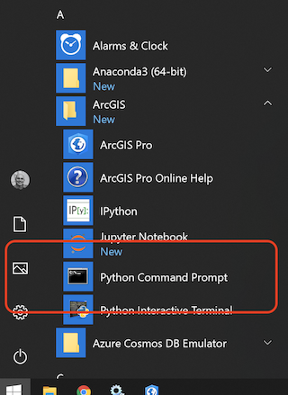
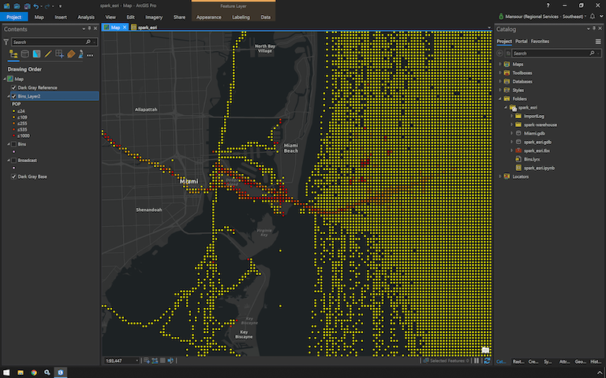
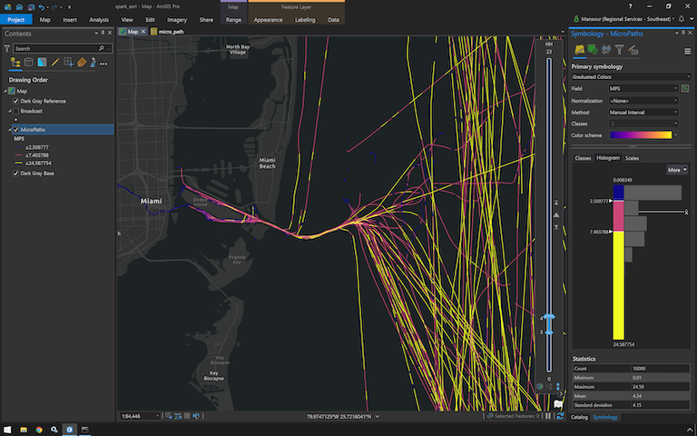
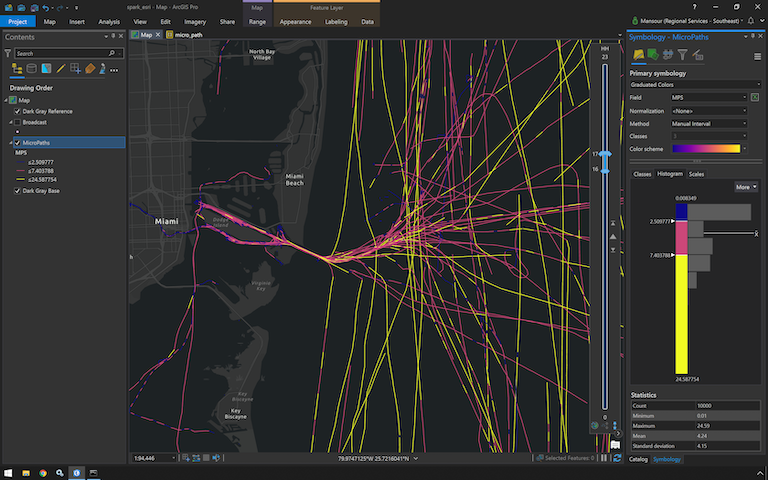
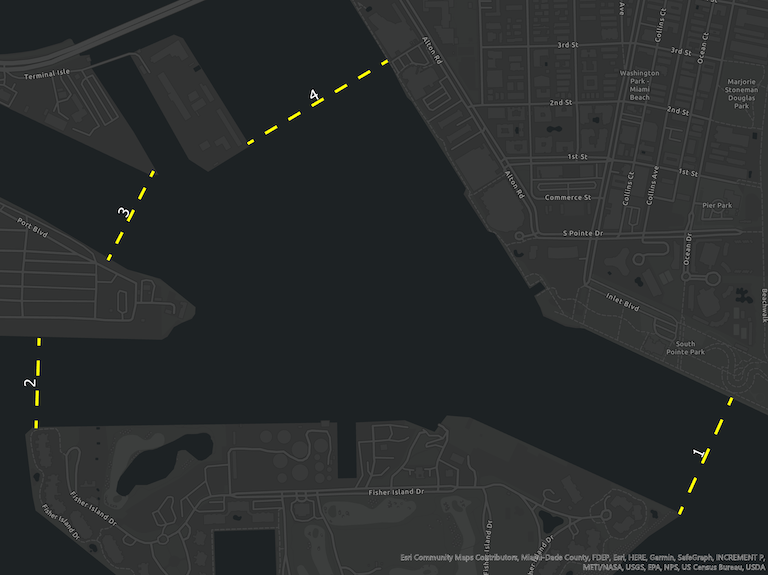
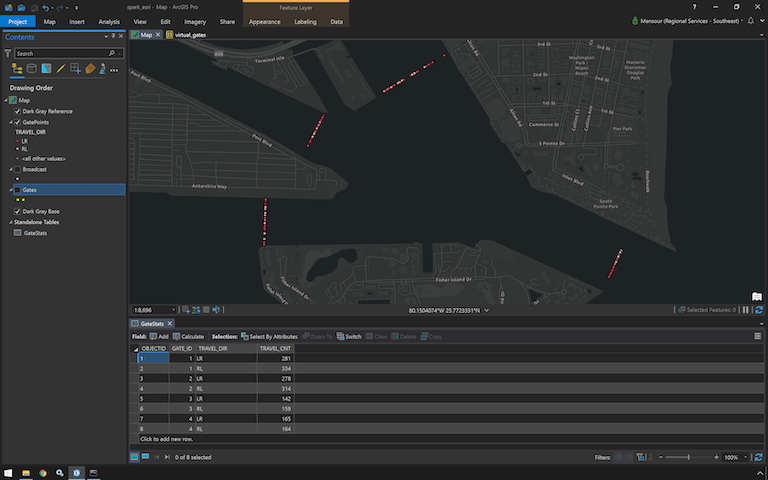
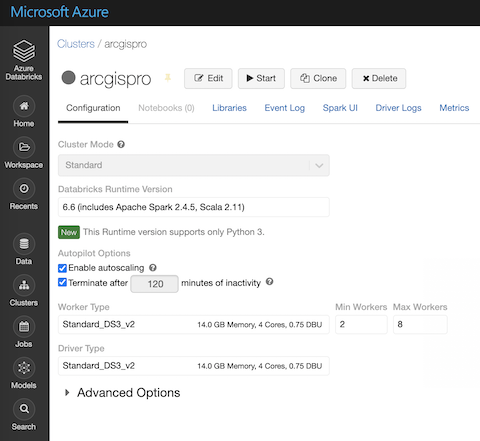

# Spark ESRI

Project to demonstrate the usage of [Apache Spark](https://spark.apache.org/) within a [Jupyter notebook within ArcGIS Pro](https://pro.arcgis.com/en/pro-app/arcpy/get-started/pro-notebooks.htm).

### Create a new Pro Conda Environment.

Start a `Python Command Prompt`:



Execute the following commands:

```commandline
conda remove --yes --all --name spark_esri
conda create --yes --name spark_esri --clone arcgispro-py3
activate spark_esri
pip install pyarrow
proswap spark_esri
```

Install the Esri Spark module.

```commandline
git clone https://github.com/mraad/spark-esri.git
cd spark-ersi
python setup.py install
```

Note that the `java_gateway.py` code is borrowed from Spark 3.0 source code. Hoping that this will not be needed when we will switch to 3.0.

### [Spatial Binning](spark_esri.ipynb) Notebook




### [MicroPathing](micro_path.ipynb) Notebook



Please note the usage of the [range slider](https://pro.arcgis.com/en/pro-app/help/mapping/range/get-started-with-the-range-slider.htm) on the map to filter the micropaths between a user defined hour of day.



### [Virtual Gate Crossings](virtual_gates.ipynb) Notebook



The following is the resulting crossing points and gates statistics.



### [Remote Execution on MS Azure Databricks](spark_dbconnect.ipynb) Notebook



## TODO

- Unify spark_esri and spark_dbconnect python modules.

## References

- https://www.geeksforgeeks.org/check-if-two-given-line-segments-intersect/
- https://www.kite.com/python/answers/how-to-check-if-two-line-segments-intersect-in-python
- https://pandas.pydata.org/pandas-docs/stable/development/extending.html
- https://pandas.pydata.org/pandas-docs/stable/user_guide/style.html
- https://www.esri.com/arcgis-blog/products/arcgis-pro/health/use-proximity-tracing-to-identify-possible-contact-events/
- https://marinecadastre.gov/ais/
